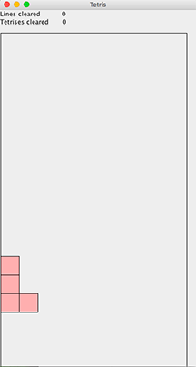
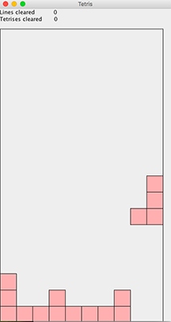
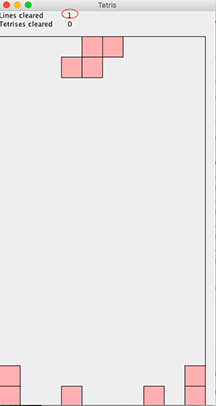

# Tetris

Tetris is a tile-matching puzzle video game orginially designed by Alexey Pajitnov and released in 1984. This program construct a simple version of Tetris. 

In the game, puzzle pieces with the shape of I, L, J, T, S, Z, O fall down from the top of the window to the bottom of the window. While the pieces are falling, user needs to decide where to put them so as to fill as many horizontal lines as possible. Each full horizontal line is cleared from the window and counted towards the total score.

User can make the pieces:
- Move to the left: Left arrow key
- Move to the right: Right arrow key
- Increase falling speed: Down arrow key
- Rotate clockwise: X key
- Rotate counter clockwise: Z key

 

              

 

## Tetris board is a two-dimensional array of boolean values
In this program, a Tetris board is a two-dimensional array of *true* or *false* values. At the beginning of the game, these values are initialized to *false*. In the space where a Tetris piece is present, the values are set to *true*. By incrementing or decrementing array indices, the piece can move left, right or down. The use of a timer and an action listener creates the effect of the piece automatically "falling down" by gravity.

## Each Tetris piece is a three-dimensional array of boolean values
Each Tetris piece is a three-dimensional array containing 4 two-dimensional arrays that represent 4 possible rotations of that piece. The arrangment of *true* and *false* values creates the shape of each Tetris piece. By incrementing or decrementing array indices, the piece can move clockwise or counter clockwise.

## A fine is full when having all *true* values and cleared when having all *false* values
When a line is full - meaning that the row is filled with *true* values - the program increases the score, changes true values to false, and loop through the board to copy everything down one row. These actions create the effect that a row is cleared, and consequently, blocks above the removed row can fall down to the ground.

## File description
* [TetrisBoard.java](https://github.com/vantrinh7/Tetris/blob/master/src/TetrisBoard.java) creates the board, adds a new piece and lands the piece. It has methods to check if the movements (left, right and down) and rotations (clockwise and counter-clockwise) are valid. It also detects possible collisions and out-of-bounds situations.
* [TetrisBoardGUIView.java](https://github.com/vantrinh7/Tetris/blob/master/src/TetrisBoardGUIView.java) draws the board and Tetris pieces using information from a Tetris board variable.
* [TetrisGame.java](https://github.com/vantrinh7/Tetris/blob/master/src/TetrisGame.java) has methods that determines the rules of Tetris game. It also determines the end of a round by landing a piece, calculating number of lines cleared and adding a new piece to the board.
* [TetrisGUIController.java](https://github.com/vantrinh7/Tetris/blob/master/src/TetrisGUIController.java) has a TetrisBoardGUIView variable and a TetrisGame variable. It is responsible for creating a view with BorderLayout, setting up a timer, refreshing the display and handling key pressed events.
* [TetrisPiece.java](https://github.com/vantrinh7/Tetris/blob/master/src/TetrisPiece.java) defines a Tetris piece, with methods to rotate clockwise, rotate counterclockwise, and check the boolean value at a certain position on the piece.
* [TetrisL1.java](https://github.com/vantrinh7/Tetris/blob/master/src/TetrisL1.java), [TetrisL2.java](https://github.com/vantrinh7/Tetris/blob/master/src/TetrisL2.java), [TetrisS1.java](https://github.com/vantrinh7/Tetris/blob/master/src/TetrisS1.java), [TetrisS2.java](https://github.com/vantrinh7/Tetris/blob/master/src/TetrisS2.java), [TetrisSquare.java](https://github.com/vantrinh7/Tetris/blob/master/src/TetrisSquare.java), [TetrisStick.java](https://github.com/vantrinh7/Tetris/blob/master/src/TetrisStick.java), and [TetrisT.java](https://github.com/vantrinh7/Tetris/blob/master/src/TetrisT.java) specify a Tetris piece with the shape of L, J, S, Z, O, I and T, respectively. 
